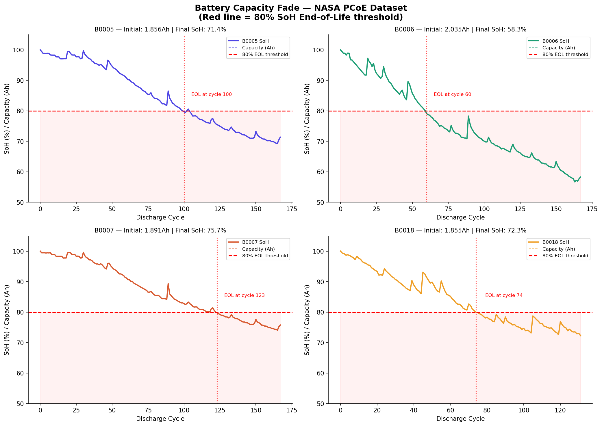

# Battery State-of-Health Intelligence Platform

> Predict degradation · Estimate remaining useful life · Recommend maintenance actions for Indian operating conditions

[](https://batteryhealth-platform.streamlit.app/)
[](https://www.python.org/)
[](https://scikit-learn.org/)
[](https://xgboost.readthedocs.io/)

---

## Live Demo

**👉 [Launch App — batteryhealth-platform.streamlit.app](https://batteryhealth-platform.streamlit.app/)**



---

## Problem Statement

Battery degradation is a critical challenge for Indian energy and EV companies. Batteries operating in Indian conditions (35–45°C ambient temperature, irregular charging, monsoon humidity) degrade 15–30% faster than lab-tested specifications suggest.

Most BMS tools rely on lab-condition data with no adjustment for real-world Indian deployment. This platform bridges that gap by:

- Predicting **State of Health (SoH%)** from real discharge cycle signals
- Estimating **Remaining Useful Life (RUL)** in cycles
- Detecting **anomalous discharge cycles** before failure occurs
- Adjusting predictions for **Indian climate conditions** by state, season, and application

---

## Key Results

| Metric | Value |
|---|---|
| SoH Model | Random Forest |
| SoH R² (unseen battery) | **0.9421** |
| SoH MAE | **1.69%** |
| RUL Model | XGBoost |
| RUL R² (unseen battery) | **0.8594** |
| RUL MAE | **6.19 cycles** |
| Anomalies detected | **32 / 636 cycles (5%)** |
| Training set | 504 cycles (B0005, B0006, B0007) |
| Test set | 132 cycles (B0018 — completely unseen battery) |

---

## Features

### Single Battery Analysis
- Input voltage, current, temperature, and cycle history signals
- Instant SoH% prediction with colour-coded health tier (Healthy / Monitor / Action / Critical)
- RUL estimate in remaining discharge cycles
- Internal resistance and energy delivered per cycle
- SHAP waterfall chart explaining exactly which signals are driving degradation

### Fleet Batch Scoring
- Upload a CSV of battery cycle data
- Score entire fleet in one click
- Fleet health summary (Healthy / Monitor / Action / Critical counts)
- Download prioritised maintenance report ranked by urgency

### India Climate Mode
- State-wise adjustment factors (Rajasthan 0.78x → Karnataka 0.90x)
- Seasonal correction (Summer 0.82x, Monsoon 0.91x, Winter 0.97x)
- Application-specific factors (Telecom Tower 0.85x, EV 2-Wheeler 0.95x)
- Temperature degradation model based on Arrhenius equation approximation
- Actionable maintenance recommendations per deployment scenario

---

## Key Findings

1. **Voltage is the strongest health indicator** — Rolling average voltage has 0.950 correlation with SoH
2. **Energy delivered per cycle tracks degradation closely** — 0.963 correlation with SoH
3. **Discharge time predicts RUL best** — 0.850 correlation with remaining cycles
4. **B0006 degraded fastest** — reached 58.3% final SoH vs B0007's 75.7%
5. **Indian summer reduces RUL by up to 35%** — vs NASA lab conditions at 24°C
6. **Anomaly detection caught early-stage degradation** — 14 anomalies in B0006 vs 2 in B0005

---

## Tech Stack

| Layer | Tools |
|---|---|
| Data Processing | Python, pandas, numpy, scipy |
| Feature Engineering | 25 health indicators — internal resistance, thermal stress, rolling capacity fade, cumulative energy |
| Machine Learning | scikit-learn (Random Forest), XGBoost |
| Anomaly Detection | Isolation Forest |
| Explainability | SHAP |
| Forecasting | Polynomial trend fitting |
| Dashboard | Streamlit (custom CSS design system) |
| Deployment | Streamlit Community Cloud (free) |
| Version Control | GitHub |

---

## Dataset

**NASA Prognostics Center of Excellence (PCoE) Li-ion Battery Dataset**

- Batteries: B0005, B0006, B0007, B0018
- Chemistry: 18650 Li-ion cells
- Total discharge cycles: **636**
- Features engineered: **25** per cycle
- Lab conditions: 24°C, 1.5A charge / 2A discharge
- End-of-Life definition: 80% of rated capacity (industry standard)

This dataset is used in published IEEE research on battery SoH prediction, making it a credible benchmark for evaluating model performance.

---

## Project Structure

```
battery-state-of-health-intelligence-platform/
├── app/
│   └── app.py                    # Streamlit web application
├── notebooks/
│   ├── 01_data_overview.ipynb    # Data loading, capacity fade EDA
│   ├── 02_feature_engineering.ipynb  # 25 health indicators engineered
│   ├── 03_modelling.ipynb        # SoH + RUL models, anomaly detection
│   └── 04_forecasting.ipynb      # Capacity fade forecast, alert system
├── src/
│   ├── soh_model.pkl             # Trained Random Forest SoH model
│   ├── rul_model.pkl             # Trained XGBoost RUL model
│   ├── scaler.pkl                # StandardScaler for feature normalisation
│   └── feature_cols.json         # Feature column names and order
├── data/
│   └── battery_features.csv      # Engineered feature dataset
├── reports/
│   ├── capacity_fade.png         # Battery degradation curves
│   ├── feature_correlation.png   # Feature vs SoH/RUL correlation
│   ├── model_predictions.png     # Predicted vs actual SoH and RUL
│   ├── anomaly_detection.png     # Isolation Forest results
│   ├── charging_strategy.png     # Temperature vs degradation analysis
│   └── shap_summary.png          # Global SHAP feature importance
└── requirements.txt
```

---

## ML Pipeline

```
NASA PCoE Raw .mat Files (B0005–B0018)
            ↓
   Data Extraction (scipy.io.loadmat)
   636 discharge cycles extracted
            ↓
   Feature Engineering
   25 health indicators per cycle:
   voltage signals · thermal stress · internal resistance
   rolling window features · cumulative energy · India climate factors
            ↓
   Train / Test Split
   Train: B0005, B0006, B0007 (504 cycles)
   Test:  B0018 — completely unseen battery (132 cycles)
            ↓
   Model Training
   SoH → Random Forest    (R² = 0.9421)
   RUL → XGBoost          (R² = 0.8594)
   Anomaly → Isolation Forest (32 anomalies detected)
            ↓
   SHAP Explainability
   Per-cycle degradation driver analysis
            ↓
   Streamlit App + India Climate Mode
   Live deployment on Streamlit Community Cloud
```

---

## India Climate Adjustment

The India Climate Mode is a unique feature not present in standard battery analytics tools. NASA battery data is collected under controlled 24°C lab conditions. Indian batteries face:

- **Temperature:** 35–45°C ambient in summer (Rajasthan reaches 48°C)
- **Humidity:** 80–95% during monsoon (July–September)
- **Irregular charging:** Load shedding and solar variability
- **Dust and vibration:** Particularly in EV and telecom deployments

The platform applies multiplicative correction factors derived from battery thermal degradation models, providing India-realistic RUL estimates for deployment planning.

---

## Industry Applications

This project is directly relevant to Indian battery and energy companies:

- **Replus Engitech** — AI-driven BMS and EMS products for BESS and EV applications
- **Exide Industries** — Li-ion gigafactory buildout and BESS deployment
- **Amara Raja Energy & Mobility** — EV pack manufacturing and grid storage
- **JSW Neo Energy** — Utility-scale BESS projects
- **Tata Power / Agratas** — Grid and EV battery analytics
- **Battery Smart / Sun Mobility** — EV battery swap network monitoring

---

## Setup & Installation

```bash
# Clone the repository
git clone https://github.com/byteninja20/Battery-State-of-Health-Intelligence-Platform.git
cd Battery-State-of-Health-Intelligence-Platform

# Install dependencies
pip install -r requirements.txt

# Run the app
cd app
streamlit run app.py
```

---

## About

Built by **Rahul Kumar Singh** — B.Tech 3rd year, Computer Science & Engineering, Tula's Institute, Dehradun.

This project was built as an internship-level Data Analytics portfolio piece targeting roles in Indian battery manufacturing, EV analytics, and energy storage companies.

**Connect:**
- GitHub: [github.com/byteninja20](https://github.com/byteninja20)
- LinkedIn: [linkedin.com/in/rahul-singh20](https://linkedin.com/in/rahul-singh20)
- Live App: [batteryhealth-platform.streamlit.app](https://batteryhealth-platform.streamlit.app/)
